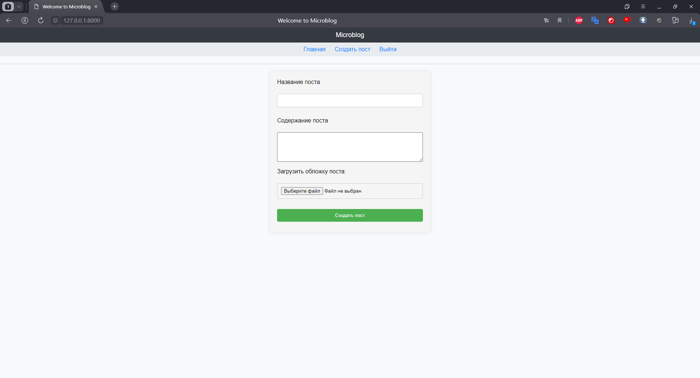

# Микроблог на FastAPI
 Этот проект был создан для знакомства с фреймворком **FastAPI** 

## Цель проекта
 - Цель проекта реализовать сервис для блогинга

### Функционал 
  На данный в приложении доступен следующий функционал:
 - Аутентификация пользователя
  
 - Регистрация пользователя
  
 - Создание поста
  
 - Просмотр поста и возможность его комментировать
   
 - Просмотр ленты постов от всех пользователей либо только от подписок
  
 - Редактирование своего профиля
  
 - Возможность подписаться/отписаться
    
 - Просмотр подписчиков и подписок
  

### БД
Были выделены следующие сущности БД
 - Пользователь
 - Пост
 - Комментарий
